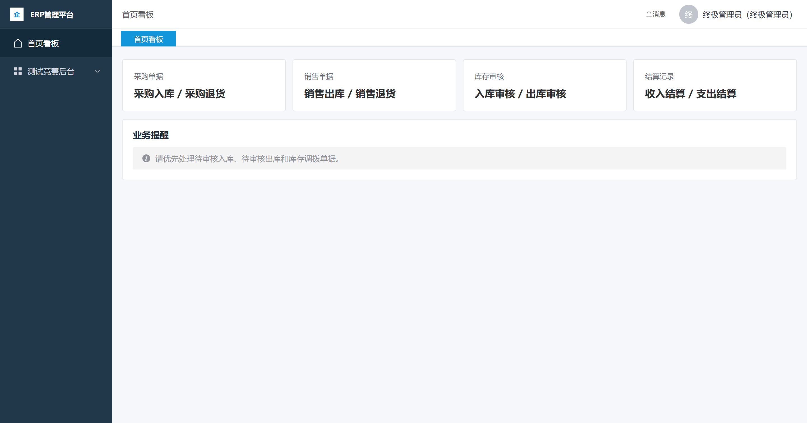

# ERP 管理平台

语言：中文 | [English](./README.en.md)

一个基于 Spring Boot 3 与 Vue 3 的前后端分离 ERP 演示系统，围绕采购、销售、库存和结算构建完整业务闭环，并扩展了面向软件测试教学的缺陷训练与竞赛模块。

项目适合课程设计、毕业实训、ERP 流程演示和前后端开发练习。仓库内置 Docker Compose + MySQL 8.4 + Flyway 数据库结构脚本，便于本地启动、数据库结构校验和部署演示。

> 说明：这是教学与演示型 ERP 项目，重点覆盖完整业务流程、角色权限、缺陷发布和学员自主测试闭环。

## 演示图

| 登录页 | 首页看板 |
| --- | --- |
| [](./docs/assets/screenshots/login-page.png) | [](./docs/assets/screenshots/home-dashboard.png) |

## 快速直达

- [快速启动](#快速启动)
- [演示账号](#演示账号)
- [测试与构建](#测试与构建)
- [部署说明](#部署说明)
- [完整操作手册](./docs/operation-manual.md)
- [项目展示说明](./docs/project-showcase.md)
- [测试计划](./docs/testing/super-admin-flow-test-plan.md)
- [需求与训练资料归档](./docs/requirements/)
- [数据库迁移脚本](./backend/src/main/resources/db/migration/V1__create_schema.sql)
- [前端源码](./frontend/src/) / [后端源码](./backend/src/main/java/com/erp/)

## 项目状态

- 核心 ERP 流程已实现：基础资料、采购、销售、库存审核、库存调拨和收支结算。
- 测试竞赛流程已实现：缺陷发布、学员管理、学员专属 ERP 子账号、报告评分、文件评阅、操作轨迹、评分历史和排行榜。
- MySQL/Flyway 本地环境已配置：Docker Compose、本地 profile、V1-V5 迁移脚本、JPA 校验和 Testcontainers 校验。
- 业务数据已接入 MySQL 实时持久化：后端启动时从 MySQL 表 `SELECT` 加载当前数据；运行中创建学员、发布缺陷、提交/审核缺陷报告、维护资料、创建/提交/审核/删除单据、库存变更、结算生成、消息通知、文件提交、评分历史和操作日志都会按业务动作实时执行对应 `INSERT` / `UPDATE` / `DELETE`。
- 后端已配置自动化测试，覆盖核心业务流程、测试竞赛流程和 MySQL 启动校验。
- 前端已配置生产构建与组件测试。
- 界面文案以中文为主。

## 核心功能

| 模块 | 已实现功能 |
| --- | --- |
| 认证与个人中心 | 用户名密码登录、JWT 鉴权、当前用户信息、修改密码、头像上传、退出登录 |
| 基础信息管理 | 商品品牌、商品分类、商品单位、商品、仓库、客户、供应商；支持新增、编辑、状态切换、搜索和商品批量导入 |
| 采购管理 | 采购入库、采购退货、单据编辑、提交、删除和详情查看 |
| 销售管理 | 销售出库、销售退货、单据编辑、提交、删除和详情查看 |
| 库存管理 | 库存分布、入库审核、出库审核、审核通过/拒绝、库存调拨和仓库消息通知 |
| 结算管理 | 收入结算、支出结算、结算详情和关联业务单据查看 |
| 测试竞赛 | 缺陷库、学员账号、自主测试、缺陷报告、测试文件、评分、操作日志、历史成绩和排行榜 |

## 业务闭环

```text
基础资料
   ↓
创建采购 / 销售 / 调拨单据
   ↓
待提交 → 待审核 → 审核通过 / 审核拒绝
   ↓
库存数量变更 + 收支结算生成 + 仓库消息通知
```

系统支持以下业务单据：

| 单据 | 审核通过后的库存变化 | 自动生成结算 |
| --- | --- | --- |
| 采购入库 | 增加库存 | 支出结算 |
| 采购退货 | 减少库存 | 收入结算 |
| 销售出库 | 减少库存 | 收入结算 |
| 销售退货 | 增加库存 | 支出结算 |
| 库存调拨 | 调出仓减少、调入仓增加 | 不生成结算 |

主要业务规则：

- 实际库存只在单据审核通过后变化。
- 可用库存会扣除待提交、待审核和审核拒绝状态下的出库类单据数量。
- 出库类单据库存不足时不能审核通过。
- 采购退货必须关联已审核的采购入库单；销售退货必须关联已审核的销售出库单。
- 退货数量不能超过关联原单的剩余可退数量。
- 商品存在库存或未完结单据时不能直接停用。
- 库存调拨分别通知调出仓和调入仓的仓库专员。
- 测试学员拥有独立业务工作区，并自动配备管理员、采购专员、仓库专员、销售专员和结算主管子账号；不同学员的基础资料、单据、审核任务、库存和结算数据相互隔离。

## 测试竞赛扩展

该模块把 ERP 系统作为软件测试训练环境：终极管理员发布预置缺陷，每名学员拥有一套独立 ERP 工作区和岗位子账号。学员先用主账号进入测试竞赛端，再点击“进入我的 ERP 工作区”，选择管理员、采购、仓库、销售或结算岗位并输入密码；系统会自动匹配 `student01_*` 子账号，不需要手写账号前缀。学员在自己的 ERP 工作区完成业务测试后，点击右上角退出 ERP 子身份会自动恢复学员主会话，回到学员端继续提交缺陷报告和测试材料。终极管理员评分后生成排行榜和历史记录。这里的“发布缺陷”表示开启系统中的对应错误行为，不会把缺陷编号、摘要或任务清单展示给学员。

| 角色 | 能力 |
| --- | --- |
| 终极管理员 | 管理学员、发布缺陷、评阅测试文件、查看操作轨迹、评分历史和排行榜 |
| 测试学员 | 使用主账号提交缺陷报告和测试文件、查看个人记录与排行榜；使用自动生成的 ERP 子账号在独立工作区自主发现缺陷；不显示已发布缺陷清单 |

测试文件支持 `.pdf`、`.doc`、`.docx`、`.xls` 和 `.xlsx`。上传文件保存在后端运行目录下的 `uploads/competition/<用户名>/`。

## 技术栈

### 后端

- Java 17
- Spring Boot 3.3.6
- Spring Web
- Spring Data JPA
- MyBatis-Plus 3.5.x
- Spring Security
- Jakarta Validation
- Flyway
- MySQL Connector/J
- JJWT 0.12.6
- Maven Wrapper
- JUnit 5 / Spring Boot Test / Spring Security Test / Testcontainers

### 前端

- Vue 3.5
- TypeScript 5.6
- Vite 6
- Vue Router 4
- Pinia 2
- Element Plus 2
- Axios 1.7
- Vitest 2

### 数据与认证

- 数据库使用 MySQL 8.4，本地默认连接 `127.0.0.1:3306/erp`。
- 数据库结构由 Flyway 管理，`V1__create_schema.sql` 创建工作区、用户、基础资料、业务单据、库存、结算、消息和竞赛相关表，`V2` 允许学员自发现缺陷报告不绑定官方缺陷编号，`V3` 放宽缺陷严重程度字段以兼容完整训练数据，`V4` 会把历史库里的平台 `admin` 账号改名并禁用，平台竞赛管理统一使用 `superadmin`，`V5` 会为旧库补齐 `sys_user.password_hash`，修复空密码哈希并恢复非空约束。
- 后端默认启用 `local` profile，会读取仓库根目录 `.env`，并可通过 `DB_HOST`、`DB_PORT`、`DB_NAME`、`DB_USERNAME`、`DB_PASSWORD` 覆盖数据库连接；如果只配置了 `MYSQL_USER` / `MYSQL_PASSWORD`，本地 profile 也会自动兼容。
- 运行演示数据由后端业务服务初始化：只有在业务表为空时才插入默认演示账号、工作区、基础资料和缺陷库；如果表里已有数据，后端直接读取现有 MySQL 数据。
- 持久化不是“存档/读档”模式：项目没有整库状态快照保存逻辑，业务运行中按具体动作实时写 MySQL 表；例如发布缺陷只更新 `test_bug_definition`，提交缺陷报告只插入 `test_bug_report`，审核单据会更新 `biz_document`、写 `inventory_balance`、必要时写 `finance_settlement`。
- 用户密码只以 BCrypt 哈希保存在 `sys_user.password_hash`，数据库不会出现可直接查看的明文 `password` 字段；`V5` 只修复缺失或空白哈希，不覆盖已有有效密码。
- 登录后使用 JWT Bearer Token 访问受保护接口；账号被禁用后不能重新登录，禁用前签发的 Token 也不再通过认证。
- 除 `/api/auth/login` 外，其他 API 均要求登录。

### 后端分层架构

后端按课堂常见 Java Web 分层组织：

```text
Controller -> DTO -> Service -> Store/Domain -> Mapper -> MySQL
```

- `web/`：Controller 层，只负责 HTTP 路由、参数接收和统一响应。
- `dto/`：DTO 层，放登录、学员、缺陷发布、审核、状态切换等请求对象。
- `service/`：Service 层，承接 Controller 调用，处理登录、竞赛、资料、单据、库存、结算等业务入口。
- `domain/`：领域模型层，保留 ERP 业务对象、枚举和状态模型。
- `store/`：核心业务规则层，负责 ERP 闭环规则、缺陷开关、学员工作区隔离和实时持久化编排；复杂单据、库存、结算写库逻辑暂时仍集中在该层，后续可继续拆到自定义 Mapper。
- `entity/`：数据库实体层，使用 MyBatis-Plus 注解映射核心表。
- `mapper/`：Mapper 层，使用 MyBatis-Plus `BaseMapper` 对接 MySQL，已建立工作区、用户、商品、单据、缺陷定义、缺陷报告等核心表 Mapper。
- `common/`、`security/`：统一响应、异常处理、JWT 和 Spring Security 配置。

## 目录结构

```text
ERP/
├─ backend/                         # Spring Boot 后端
│  ├─ src/main/java/com/erp/
│  │  ├─ common/                    # 统一响应、业务异常、全局异常处理
│  │  ├─ dto/                       # 请求/响应 DTO
│  │  ├─ domain/                    # 领域模型和枚举
│  │  ├─ entity/                    # MyBatis-Plus 数据库实体
│  │  ├─ mapper/                    # MyBatis-Plus Mapper 层
│  │  ├─ security/                  # JWT 与 Spring Security 配置
│  │  ├─ service/                   # 业务 Service 层
│  │  ├─ store/                     # 业务编排、演示数据和规则开关服务
│  │  └─ web/                       # REST 控制器
│  ├─ src/main/resources/           # 应用配置、Flyway 迁移和缺陷训练数据
│  │  └─ db/migration/              # 数据库迁移脚本
│  └─ src/test/java/com/erp/        # 后端单元与集成测试
├─ frontend/                        # Vue 3 前端
│  ├─ src/api/                      # Axios 封装和接口定义
│  ├─ src/layouts/                  # 应用布局
│  ├─ src/router/                   # 前端路由与登录守卫
│  ├─ src/stores/                   # Pinia 状态
│  ├─ src/views/                    # ERP 与竞赛页面
│  └─ src/tests/                    # 前端测试
├─ compose.yaml                     # 本地 MySQL 服务
├─ .env.example                     # 本地数据库环境变量示例
├─ docs/                            # 设计、计划、测试、展示和需求归档
│  ├─ requirements/                 # 需求说明书、提取文本、训练 Bug 清单
│  ├─ archive/backups/              # 旧源码备份包
│  └─ assets/screenshots/           # 截图素材
├─ logs/                            # 本地运行日志，已被 Git 忽略
└─ README.md
```

## 环境要求

- JDK 17 或更高版本
- Node.js 20 LTS 或更高版本
- npm 10 或兼容版本
- Docker Desktop 或可用的 Docker Engine / Docker Compose
- Windows PowerShell

后端已包含 Maven Wrapper，不需要单独安装 Maven。

检查环境：

```powershell
java -version
node --version
npm.cmd --version
docker --version
docker compose version
```

## 快速启动

需要同时启动 MySQL、后端和前端。建议分别打开三个 PowerShell 窗口。

### 1. 启动 MySQL

在仓库根目录执行：

```powershell
Copy-Item .env.example .env
docker compose up -d mysql
docker compose ps
```

默认数据库连接信息：

| 变量 | 默认值 |
| --- | --- |
| `DB_HOST` | `127.0.0.1` |
| `DB_PORT` | `3306` |
| `DB_NAME` | `erp` |
| `DB_USERNAME` | `erp` |
| `DB_PASSWORD` | `erp_local_password` |
| `MYSQL_ROOT_PASSWORD` | `erp_root_local_password` |

如果你本机 `3306` 已经有 `erp` 数据库，直接使用这套库，不要再启动 compose 的 mysql 服务。只有需要新建本地容器数据库时，再执行上面的 compose 命令。

### 2. 启动后端

```powershell
cd backend
.\mvnw.cmd spring-boot:run
```

后端启动时会连接 MySQL，并由 Flyway 自动执行数据库迁移。

后端默认地址：`http://127.0.0.1:8080`

### 3. 安装前端依赖并启动

首次运行：

```powershell
cd frontend
npm.cmd install
npm.cmd run dev
```

后续运行只需：

```powershell
cd frontend
npm.cmd run dev
```

### 4. 访问系统

浏览器打开：<http://127.0.0.1:5173>

Vite 开发服务器会把 `/api` 请求代理到 `http://127.0.0.1:8080`。

## 演示账号

所有内置账号的初始密码均为 `123456`。

终极管理员可在“测试竞赛 -> 学员管理”中点击“重置密码”。该操作会将所选学员的主账号以及管理员、采购、仓库、销售、结算 5 个 ERP 子账号同时重置为 `123456`，成功提示会显示实际重置的账号数量；其他学员和平台账号不受影响。

| 账号 | 角色 | 主要用途 |
| --- | --- | --- |
| `superadmin` | 终极管理员 | 学员管理、缺陷发布、缺陷报告评分、测试文件评阅、操作轨迹、评分历史和排行榜 |
| `purchase_manager` | 采购主管 | 查看采购模块和采购单据 |
| `purchase_staff` | 采购专员 | 创建和维护自己的采购单据 |
| `warehouse_manager` | 仓库主管 | 查看库存与审核业务 |
| `warehouse_staff` | 仓库专员 | 华东仓库审核与消息通知 |
| `warehouse_staff_south` | 仓库专员 | 备用仓库专员演示账号 |
| `sales_manager` | 销售主管 | 查看销售模块和销售单据 |
| `sales_staff` | 销售专员 | 创建和维护自己的销售单据 |
| `settlement_manager` | 结算主管 | 查看收入和支出结算 |
| `student01` | 测试学员主账号 | 提交缺陷报告、上传测试文件、查看个人记录与排行榜 |
| `student01_admin` | 学员 ERP 管理员 | `student01` 工作区内维护基础资料并查看 ERP 全模块；不具备平台缺陷发布/学员管理权限 |
| `student01_purchase_staff` | 学员 ERP 采购专员 | `student01` 工作区内创建采购入库、采购退货 |
| `student01_warehouse_staff` | 学员 ERP 仓库专员 | `student01` 工作区内审核入库、出库和调拨 |
| `student01_sales_staff` | 学员 ERP 销售专员 | `student01` 工作区内创建销售出库、销售退货 |
| `student01_settlement_manager` | 学员 ERP 结算主管 | `student01` 工作区内查看收入和支出结算 |
| `student02` | 测试学员主账号 | 提交缺陷报告、上传测试文件、查看个人记录与排行榜 |

系统按角色返回菜单。每名学员的 ERP 子账号只访问所属学员工作区，`student01_*` 与 `student02_*` 的业务数据互不共享。二次登录时只需要选择岗位和输入密码，前端会自动拼接 `student01_admin`、`student01_purchase_staff` 等账号。ERP 子身份退出时会恢复进入前保存的学员主会话，不需要重新输入 `student01`。业务层还会校验终极管理员、仓库人员、工作区归属和单据所有者等权限。

## 配置说明

默认配置位于 `backend/src/main/resources/application.yml`：

```yaml
server:
  port: 8080

spring:
  profiles:
    default: local
  datasource:
    url: jdbc:mysql://${DB_HOST}:${DB_PORT}/${DB_NAME}?useUnicode=true&characterEncoding=utf8&serverTimezone=Asia/Shanghai
    username: ${DB_USERNAME}
    password: ${DB_PASSWORD}
  jpa:
    hibernate:
      ddl-auto: validate
    open-in-view: false
  flyway:
    enabled: true

erp:
  jwt-secret: "ERP-CORE-LOOP-DEVELOPMENT-SECRET-CHANGE-IN-PRODUCTION-2026"
  jwt-expire-minutes: 720
```

本地开发默认值位于 `backend/src/main/resources/application-local.yml`。如需连接其他数据库，可通过 Spring Boot 环境变量覆盖：

```powershell
$env:SERVER_PORT = "8080"
$env:DB_HOST = "127.0.0.1"
$env:DB_PORT = "3306"
$env:DB_NAME = "erp"
$env:DB_USERNAME = "erp"
$env:DB_PASSWORD = "erp_local_password"
$env:ERP_JWT_SECRET = "请替换为长度足够的随机密钥"
$env:ERP_JWT_EXPIRE_MINUTES = "120"
.\backend\mvnw.cmd -f .\backend\pom.xml spring-boot:run
```

`.env.example` 同时给 Docker Compose 和 Spring Boot local profile 使用；Spring Boot 会按 `optional:file:../.env[.properties]` / `optional:file:.env[.properties]` 读取仓库根目录或后端目录下的 `.env`。生产环境必须显式提供数据库环境变量，并替换默认 JWT 密钥。如果修改后端端口，还要同步调整 `frontend/vite.config.ts` 中的开发代理，或在部署服务器配置 `/api` 反向代理。

## API 概览

开发环境 API 根路径：`http://127.0.0.1:8080/api`

登录以外的请求需携带：

```http
Authorization: Bearer <JWT_TOKEN>
```

统一成功响应：

```json
{
  "code": 0,
  "message": "success",
  "data": {}
}
```

业务错误一般返回 HTTP `400`：

```json
{
  "code": 400,
  "message": "具体错误信息",
  "data": null
}
```

### 主要接口

| 接口前缀 | 说明 |
| --- | --- |
| `/api/auth` | 登录、当前用户、修改密码、头像 |
| `/api/masterdata` | 基础资料查询、新增、修改、状态切换和商品导入 |
| `/api/documents` | 各类业务单据列表、详情、新增、修改、提交和删除 |
| `/api/inventory` | 库存分布、入出库审核、通过和拒绝 |
| `/api/settlement` | 收入/支出结算列表和详情 |
| `/api/system` | 当前用户的系统消息 |
| `/api/competition` | 缺陷、学员、报告、测试文件、日志、历史和排行榜 |

单据类型参数：

- `purchase-inbound`：采购入库
- `purchase-return`：采购退货
- `sales-outbound`：销售出库
- `sales-return`：销售退货
- `stock-transfer`：库存调拨

## 测试与构建

### 后端测试

```powershell
cd backend
.\mvnw.cmd test
```

默认命令运行不依赖 Docker 的单元测试与内存集成测试。启动 Docker Engine 后，再显式运行 MySQL/Flyway 集成测试：

```powershell
.\mvnw.cmd -Pmysql-integration test
```

这样日常测试不会因为本机 Docker 未启动而输出 Testcontainers 环境探测错误或“测试跳过”警告；`mysql-integration` profile 会恢复包含 MySQL 测试在内的完整后端测试集，并在 Docker 不可用时明确失败。

当前覆盖包括：

- Spring 应用上下文启动
- MySQL Testcontainers 启动、Flyway 迁移和关键外键约束
- 角色菜单与核心业务模块
- 采购入库、销售出库、退货、库存调拨和结算联动
- 库存可用量、停用约束、关联单据和仓库通知
- 缺陷发布、学员端隐藏缺陷清单、自主发现报告提交、文件评阅和排行榜
- 学员 ERP 子账号、跨学员工作区隔离、操作日志和真实缺陷开关

### 前端测试

单次执行：

```powershell
cd frontend
npm.cmd test -- --run
```

开发监听模式使用 `npm.cmd test`。

### 前端生产构建

```powershell
cd frontend
npm.cmd run build
```

构建产物位于 `frontend/dist/`。Vite 可能提示单个 JavaScript 分块超过 500 kB，该提示不影响构建成功，但后续可以通过手动分包优化首屏体积。

### 后端打包

```powershell
cd backend
.\mvnw.cmd clean package
```

打包产物位于 `backend/target/erp-backend-0.0.1-SNAPSHOT.jar`。

## 部署说明

当前仓库没有绑定特定云平台，可按“MySQL + 后端 JAR + 前端静态文件”方式部署。

### 准备数据库

本地或测试环境可直接复用仓库内 Compose 配置：

```powershell
docker compose up -d mysql
```

服务器部署时可使用云数据库或自建 MySQL。后端启动账号至少需要当前库的建表、索引、外键和迁移历史表写入权限，Flyway 会在启动时自动执行 `backend/src/main/resources/db/migration/` 下的迁移脚本。

### 启动后端 JAR

```powershell
$env:DB_HOST = "127.0.0.1"
$env:DB_PORT = "3306"
$env:DB_NAME = "erp"
$env:DB_USERNAME = "erp"
$env:DB_PASSWORD = "erp_local_password"
$env:ERP_JWT_SECRET = "请替换为长度足够的随机密钥"
java -jar .\backend\target\erp-backend-0.0.1-SNAPSHOT.jar
```

### 部署前端

1. 执行 `npm.cmd run build` 生成 `frontend/dist/`。
2. 使用 Nginx、Caddy 或其他静态服务器托管 `dist`。
3. 把 `/api` 反向代理到 Spring Boot 服务。
4. 为 Vue Router history 模式配置回退到 `index.html`。

Nginx 核心配置示例：

```nginx
server {
    listen 80;
    server_name _;
    root /path/to/frontend/dist;
    index index.html;

    location / {
        try_files $uri $uri/ /index.html;
    }

    location /api/ {
        proxy_pass http://127.0.0.1:8080;
        proxy_set_header Host $host;
        proxy_set_header X-Real-IP $remote_addr;
    }
}
```

## 数据库与运行环境

项目提供可直接启动的 MySQL/Flyway 本地运行环境：

- `compose.yaml` 提供本地 MySQL 8.4 服务，数据保存在 Docker volume `erp_mysql_data`。
- `backend/src/main/resources/application.yml` 配置 Spring DataSource、JPA validate 和 Flyway。
- `backend/src/main/resources/application-local.yml` 提供本地开发默认数据库连接。
- `backend/src/main/resources/db/migration/V1__create_schema.sql` 创建 19 张核心表，并通过工作区外键约束隔离租户数据。
- `backend/src/test/java/com/erp/PersistenceBootstrapTest.java` 校验 MySQL 启动、关键表结构和外键约束。
- 竞赛上传文件保存在后端运行目录下的 `uploads/competition/<用户名>/`；如需多实例部署，应改为对象存储或共享文件存储。

常用数据库命令：

```powershell
# 查看 MySQL 容器状态
docker compose ps

# 停止 MySQL，但保留数据卷
docker compose stop mysql

# 删除 MySQL 容器和数据卷；会清空本地数据库
docker compose down -v
```

## 常见问题

### 前端提示“请求失败”

确认后端已启动并监听 `8080` 端口，再检查 `frontend/vite.config.ts` 的代理地址。

```powershell
Invoke-WebRequest http://127.0.0.1:8080/api/auth/login -Method POST -ContentType 'application/json' -Body '{"username":"superadmin","password":"123456"}'
```

### 端口被占用

查看占用进程：

```powershell
Get-NetTCPConnection -LocalPort 8080,5173,3306 -ErrorAction SilentlyContinue
```

后端端口可通过 `SERVER_PORT` 修改；前端端口可在 `frontend/vite.config.ts` 修改；MySQL 端口可在 `.env` 的 `DB_PORT` 中修改。

### 后端启动时报数据库连接失败

先确认 MySQL 容器健康：

```powershell
docker compose ps
```

再确认后端使用的 `DB_HOST`、`DB_PORT`、`DB_NAME`、`DB_USERNAME`、`DB_PASSWORD` 与 `.env` 或 Compose 默认值一致。本地默认端口是 `3306`。

### 修改数据库账号密码后仍然登录失败

MySQL 初始化账号只会在数据卷首次创建时生效。如果已经创建过 `erp_mysql_data`，修改 `.env` 后不会自动重置已有账号。开发环境可以清空数据卷后重建：

```powershell
docker compose down -v
docker compose up -d mysql
```

### 为什么用户表里没有明文 password 字段

系统使用 `sys_user.password_hash` 保存 BCrypt 哈希，属于不可逆的密码校验值，因此不会保存或展示明文密码。旧数据库启动后由 Flyway `V5__repair_user_password_hash.sql` 自动补齐缺失字段，并将缺失或空白哈希修复为默认密码 `123456` 对应的 BCrypt 哈希；已有非空哈希保持不变。学员忘记密码时，由 `superadmin` 在“学员管理”中执行重置即可。

### 修改 JWT 密钥后原 Token 失效

旧 Token 无法用新密钥验证，清除浏览器本地登录状态后重新登录即可。

### Maven 或 npm 首次运行较慢

首次执行需要下载依赖。确认网络和 Maven/npm 镜像配置正常后重试。

## 当前限制

- 未接入缓存、消息队列和对象存储。
- 认证使用单一访问 Token，未实现刷新 Token、强制下线和登录审计。
- 当前仍更适合单机演示和教学，不适合直接作为生产 ERP 投入使用。
- 已补充基础 DTO 层；单据和部分基础资料因字段随业务类型变化仍保留动态 Map，后续可继续细化为强类型 DTO 并补充 OpenAPI 文档。
- 前端生产包尚未进行细粒度依赖分包。

## 相关文档

- [整体操作手册](docs/operation-manual.md)
- [项目展示与答辩说明](docs/project-showcase.md)
- [ERP 核心闭环设计](docs/superpowers/specs/2026-06-16-erp-core-loop-design.md)
- [ERP 核心闭环实施计划](docs/superpowers/plans/2026-06-16-erp-core-loop.md)
- [需求覆盖审查](docs/reviews/2026-06-16-requirement-coverage-review.md)

## License

仓库当前未提供开源许可证文件。若需要公开发布或复用，请先补充明确的许可证。
